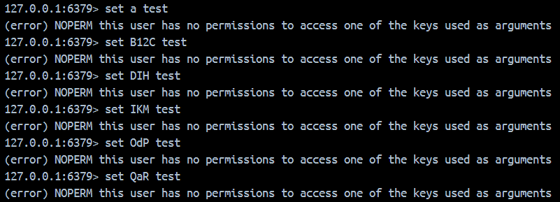

# Redis ACL (Access Control List)
## 啟用與停用
- `[on/off]`
    - 啟用或停用 user。
    - 如果已經完成驗證，該 user 才被停用的話，完成驗證的人員仍可以繼續操作。
    - 如果 `default` 被設置為 `off`，連入的人員均需要完成驗證。

## 指令的權限
- `[+/-]<command>`
    - 增加或減少 user 可以使用的指令。
    - 可以使用 `|` 來設定子指令（例如：`+config|get`）。
- `[+/-]@<category>`
    - 依據類別，增加或減少 user 可以使用的指令。
    - 完整的類別清單可以透過 `ALT CAT` 指令取得。
    - `@all` 是特殊的類別，不存在於 `ALT CAT` 的結果中，指所有的指令。
- `[allcommands/nocommands]`
    - 類似於 `[+/-]@all`，但包含了所有指令（例如後續安裝 module 時新增的指令）。

## key 的權限
### 語法
- `~<pattern>`
    - 設置 user 可以使用的 key。
    - `~*` 使 user 可以使用所有 key。
- `%R~<pattern>`
    - 設置 user 可以讀取的 key。
    - 需要 Redis 7.0 或以上。
- `%W~<pattern>`
    - 設置 user 可以寫入的 key。
    - 需要 Redis 7.0 或以上。
- `%RW~<pattern>`
    - 設置 user 可以讀寫的 key，和 `~<pattern>` 相同。
    - 需要 Redis 7.0 或以上。
- `allkeys`
    - 設置 user 可以使用所有的 key，和 `~*` 相同。
- `resetkeys`
    - 清除 user 的 key 權限。

### pattern
- `*` : 允許任意數量（包含 `0`）個任意字元。
    - `ACL SETUSER tora ~A*` 範例：`A` 或 `A123456789`（該位置可以使用任何字元，數量不限，沒有字元也可以）
- `?` : 允許具有正好一個的任意字元。
    - `ACL SETUSER tora ~B?C` 範例：`B1C`（該位置可以使用任何字元，但只能一個）
- `[...]` : 允許屬於符合方框內的字元。
    - `ACL SETUSER tora ~D[EFG]H` 範例：`DFH`（該位置僅能使用 `EFH` 中任一個字元）
- `[^...]` : 允許不屬於符合方框內的字元。
    - `ACL SETUSER tora ~I[^JKL]M` 範例：`INM`（該位置不可以使用 `JKL` 中任一個字元）
- `[?-?]` : 允許符合方框內範圍的字元。
    - `ACL SETUSER tora ~O[a-c]P` 範例：`ObP`（該位置僅能使用 `abc` 中任一個字元）
- `\*` : 允許使用 `*` 字元，而不是作為特殊字元。
    - `ACL SETUSER tora ~Q\*R` 範例：`Q*R`

### 實測
- 如果一個 user 已經設置過，則需要先執行 `ACL SETUSER <user> resetkeys` 清除掉舊的設定後，再進行設定。
- 基礎測試
    - 執行 `ACL SETUSER tora resetkeys` 清除掉原本的 `~*`（可使用所有的 key）。
    - 執行 `ACL SETUSER tora ~AAA* ~BBB*`，使 `tora` 只能使用以 `AAA` 或 `BBB` 起頭的 key
    - `set AAA1 123` 與 `get AAA1` 因 key 符合設定，順利執行。
    - `set a 123`、`set CCC1 456` 與 `get CCC1` 均因 key 不符合設定，執行失敗。

- pattern 實測正例

- pattern 實測反例
    - `B12C` 不符合 `~B?C` : 字元個數超過。
    - `DIH` 不符合 `~D[EFG]H*` : 中間的字元只能接受 `EFG`。
    - `IKM` 不符合 `I[^JKL]M*` : 中間的字元使用到了 `JKL`。
    - `OdP` 不符合 `~O[a-c]P` : 中間的字元必須屬於 `a 到 c`（即 `a、b 與 c`）之間。
    - `QaR` 不符合 `Q\*R` : key 必須是 `Q*R`。

## channel 的權限
- `&<pattern>`
    - 設置 user 可以使用的 channel。
    - `&*` 使 user 可以使用所有 channel。
    - 需要 Redis 6.2 或以上。
- `allchannels`
    - 設置 user 可以使用所有的 channel，和 `&*` 相同。
- `resetchannels`
    - 清除 user 的 channel 權限。

## 密碼的設置
- `><password>`
    - 設置 user 可以使用的密碼
- `<<password>`
    - 移除 user 可以使用的密碼
- `nopass`
    - 移除 user 所有的密碼，並標記該 user 不需要密碼且使用任何密碼都能通過驗證。
    - `resetpass` 會移除標記。
- `resetpass`
    - 移除 user 所有的密碼與 `nopass` 標記。
    - 這會使該 user 直到設置新密碼或是得到 `nopass` 標記之前，都完全無法通過驗證。

# 參考資料
1. [ACL | Redis](https://redis.io/docs/management/security/acl/)