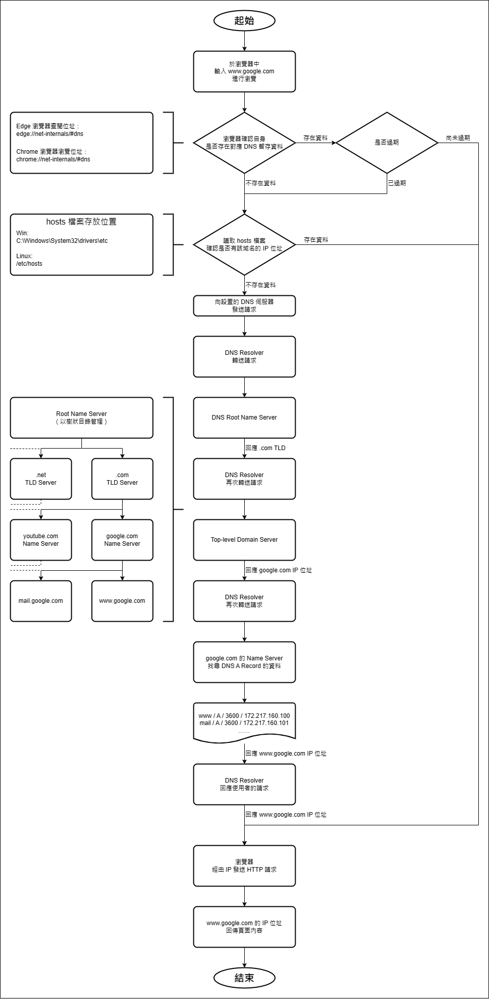

# Nodejs-Practice
這是個人學習與練習 Node.js 所使用的 Repo。

# 課題 Topic. 13
1. 學習 DNS 的運作流程
2. 將使用者於瀏覽器中連入 `www.google.com` 的過程，以流程圖的方式呈現
    - 需要包含 hosts file/ 本機 DNS 設定/ Top level domain/ name server/ dns a record

# 練習記錄

# 參考資料
1. [什麼是 DNS – DNS 簡介 – AWS](https://aws.amazon.com/tw/route53/what-is-dns/)
2. [dns 是什麼？如何運作解析懶人包 | Cloudflare](https://www.cloudflare.com/zh-tw/learning/dns/what-is-dns/)
3. [鳥哥私房菜 - 第十七章、簡易 DNS 伺服器設定](https://www.vbird.org/linux_server/redhat9/0350dns.php)
4. [DNS 查詢流程概念筆記 - Emmie Lin - Medium](https://emmielin.medium.com/dns-%E6%9F%A5%E8%A9%A2%E6%B5%81%E7%A8%8B%E6%A6%82%E5%BF%B5%E7%AD%86%E8%A8%98-3a420460d396)
5. [DNS域名解析流程图（详细）_十年少i的博客-CSDN博客](https://blog.csdn.net/fristjcjdncg/article/details/108463501)

# 編輯記錄
1. 2023-05-31
    - 開始進行 Topic. 13
2. 2023-06-01
    - 更新參考資料
3. 2023-06-02
    - 完成 Topic. 13
4. 2023-06-05
    - 更新流程圖