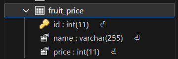

# Nodejs-Practice
這是個人學習與練習 Node.js 所使用的 Repo。

# 課題 Topic. 10
1. 在開發環境下，接收指定 `MQTT broker server` 的資料
2. `MQTT broker server` 會每 10 秒發送一次資料，同樣以每 10 秒的頻率發送一次資料給前端
3. 使前端顯示上述資料

# 練習記錄
## 建置連線
### 環境設定
修改 `ecosystem.config.js` 檔案，在 `app` 中的 `env` 填入連向 `MQTT broker server` 的資料：
```
{
    ...,
    env: {
        ...,
        "MQTT_URL": "mosquitto",
        "MQTT_PORT": 1883,
        "MQTT_USERNAME": "tora",
        "MQTT_PASSWORD": "1234",
        "MQTT_TOPIC": "msgTest",
    }
},
```

### 建置連線
1. 修改 `src\main.ts` 檔案，使用 `connectMicroservice` 與 `startAllMicroservices` 建立 `microservice`
```
app.connectMicroservice({
    transport: Transport.MQTT,
    options: {
        url: `mqtt://${process.env.MQTT_URL}:${process.env.MQTT_PORT}`,
        username: process.env.MQTT_USERNAME,
        password: process.env.MQTT_PASSWORD,
    },
})

...

await app.startAllMicroservices();
```
2. 修改 `src\app.module.ts` 檔案，使用 `ClientsModule.register` 註冊 client
```
ClientsModule.register([{
    name: 'MQTT_CLIENT',
    options: {
        url: `mqtt://${process.env.MQTT_URL}:${process.env.MQTT_PORT}`,
        username: process.env.MQTT_USERNAME,
        password: process.env.MQTT_PASSWORD,
    },
}]),
```
3. 修改 `src\app.controller.ts` 檔案，使用 `@MessagePattern()` 訂閱目標的 topic
```
@MessagePattern(process.env.MQTT_TOPIC)
receiveData(@Payload() payload: number[], @Ctx() context: MqttContext) {
    console.log(context.getTopic());
    console.log(payload);
    console.log(context.getPacket());
}
```

至此，於終端機中執行 `docker-compose up --build` 建置與啟動環境後，能確實收到來自 `MQTT broker server` 的資料

## 結合 `Socket.IO`
### 改變結構
1. 將 `src\app.module.ts` 與 `src\app.controller.ts` 檔案的 `MQTT broker server` 連線設置搬移至 `src\mqtt\mqtt.module.ts` 與 `src\mqtt\mqtt.controller.ts` 檔案
2. 修改 `src\mqtt\mqtt.controller.ts` 檔案的 `receiveData` 函數，使其接收到資料時將資料轉往 `src\mqtt\mqtt.gateway.ts` 觸發
```
@MessagePattern(process.env.MQTT_TOPIC)
receiveData(@Payload() payload: number[], @Ctx() context: MqttContext) {
    this.mqttGateway.emitData(payload);
}
```

### 建置 `Socket.IO` 後端環境
1. 仿照 `作業 - 8.1`，建立 `src\mqtt\mqtt.gateway.ts` 檔案，設置 `emitData` 函數處理接收資料時的事件
```
public emitData(@Payload() payload: number[]) {

    let event_topic = 'emit';
    if (payload['params']['stream'] == 'temperature') {
        event_topic += 'Temp';
    } else if (payload['params']['stream'] == 'humidity') {
        event_topic += 'Humi';
    }
    
    this.server.emit(event_topic, {
        value: payload['params']['data'],
        timestamp: moment(Date.now()).format('YYYY-MM-DD HH:mm:ss')
    });
}
```
2. 修改 `docker-compose.yml` 檔案，設置 `NestJS` container 的時區
```
node:
    ...
    environment:
        - TZ=Asia/Taipei
```

### 建置 `Socket.IO` 前端環境
1. 仿照 `作業 - 8.1`，於 `resource\topic10` 中建立 `index.html` 與 `main.js` 等檔案
2. 修改 `resource\topic10\index.html` 檔案，以顯示 `MQTT broker server` 的資料
3. 修改 `resource\topic10\main.js` 檔案，以處理事件
```
humidity: {
    value: 'Not update yet',
    timestamp: 'Not update yet'
},
temperature: {
    value: 'Not update yet',
    timestamp: 'Not update yet'
},

...

this.socket.on('emitHumi', (env_data) => {
    console.log(env_data);
    this.humidity.value = env_data.value;
    this.humidity.timestamp = env_data.timestamp;
});

this.socket.on('emitTemp', (env_data) => {
    console.log(env_data);
    this.temperature.value = env_data.value;
    this.temperature.timestamp = env_data.timestamp;
});
```

## 測試運行
1. 於終端機中執行 `docker-compose up --build` 建置與啟動環境
2. 使用瀏覽器連至 `http://localhost/topic10/` 確認狀況



# 參考資料
1. [MQTT - Microservices | NestJS - A progressive Node.js framework](https://docs.nestjs.com/microservices/mqtt)
2. [mqttjs/MQTT.js: The MQTT client for Node.js and the browser](https://github.com/mqttjs/MQTT.js/#mqttclientstreambuilder-options)
3. [Simplest way to implement MQTT in NestJs - DEV Community](https://dev.to/imshivanshpatel/simplest-way-to-implement-mqtt-in-nest-js-36l9)
4. [docker - Local MQTT mosquitto instance getting connect ECONNREFUSED 127.0.0.1:1883 - Stack Overflow](https://stackoverflow.com/questions/63615089/local-mqtt-mosquitto-instance-getting-connect-econnrefused-127-0-0-11883)
5. [Introducción a MQTT con NestJS - YouTube](https://www.youtube.com/watch?v=eptjyt3dEzM)
6. [date - How to set format "dd/mm/yy" in NestJS without time - Stack Overflow](https://stackoverflow.com/questions/56015112/how-to-set-format-dd-mm-yy-in-nestjs-without-time)
7. [Typescript module systems on momentJS behaving strangely - Stack Overflow](https://stackoverflow.com/questions/32987273/typescript-module-systems-on-momentjs-behaving-strangely)
8. [Using docker-compose to set containers timezones - Stack Overflow](https://stackoverflow.com/questions/39172652/using-docker-compose-to-set-containers-timezones)

# 編輯記錄
1. 2023-05-25
    - 開始進行 Topic. 10
2. 2023-05-26
    - 完成 Topic. 10
