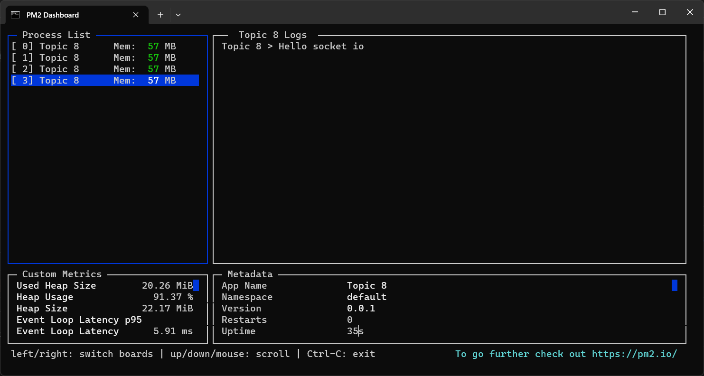
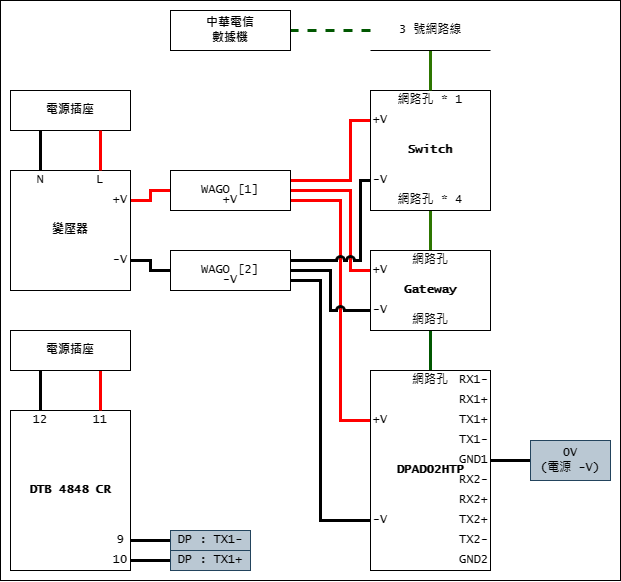
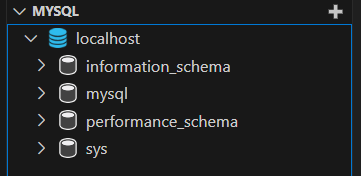
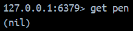
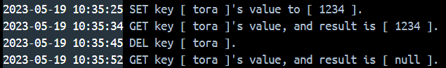

# Nodejs-Practice
這是個人學習與練習 Node.js 所使用的 Repo。

# 課題 Topic. 7
1. 使用 `TypeORM` 與 `MariaDB SQL server` 進行連線
2. 透過 `TypeORM` 建立 `fruit_price` 資料表
    - column: id, name, price
3. 實作可對 `fruit_price` 資料表進行 `insert`、`update` 與 `delete` 的 API
4. 使用 `docker-compose` 部屬環境

# 練習記錄
## `TypeOrmModule` 與 `MariaDB SQL server` 進行連線
1. 於終端機中執行 `npm install --save @nestjs/typeorm typeorm` 安裝相關套件
2. 建立 `src\maria-api\maria-api.entity.ts` 檔案，對應於 `column: id, name, price` 的要求進行設置
    - `entity` 用於定義資料庫的結構。
```
import { Entity, Column, PrimaryGeneratedColumn } from 'typeorm';

@Entity()
export class FruitPrice {
  @PrimaryGeneratedColumn()
  id: number;

  @Column({
    type: 'varchar',
    length: 255,
  })
  name: string;

  @Column()
  price: number;
}
```
3. 修改 `src\app.module.ts` 檔案
    - 引入 `./maria-api.entity`。
    - 引入 `TypeOrmModule` 並使用 `TypeOrmModule.forRoot` 設置連線。
    - `synchronize` 在正式使用時應調整為 `false`，否則將有可能遺失資料。
```
import { TypeOrmModule } from '@nestjs/typeorm';
import { MariaApiModule } from './maria-api/maria-api.module';
import { FruitPrice } from './maria-api/maria-api.entity';

@Module({
  imports: [
    TypeOrmModule.forRoot({
      type: 'mariadb',
      host: 'host.docker.internal',
      port: 3306,
      username: 'root',
      password: '1234',
      database: 'mysql',
      entities: [FruitPrice],
      synchronize: true,
    }),
  ],
})
```
4. 修改 `docker-compose.yml` 檔案
    - 由於有與 `MariaDB SQL server` 連線的需求，將 `node` container 的 `depends_on` 追加 `maria`。
5. 於終端機中執行 `docker-compose up --build` 確認資料表是否已被建立


## 建立 API 功能
1. 於終端機中透過 `nest generate` 指令，建立 `maria-api` 相關檔案
2. 修改 `src\maria-api\maria-api.module.ts` 檔案
    - 引入 `./maria-api.entity` 和 `TypeOrmModule` 並使用 `TypeOrmModule.forFeature`    
```
import { TypeOrmModule } from '@nestjs/typeorm';
import { FruitPrice } from './maria-api.entity';

@Module({
  imports: [TypeOrmModule.forFeature([FruitPrice])],
  ... ...
})
export class MariaApiModule {}
```
3. 修改 `src\maria-api\maria-api.service.ts` 檔案
    - 使用 `InjectRepository` 將 `Repository<FruitPrice>` inject 到 `MariaApiService` 中。
    - 使用 `Repository.[find/findOne/save]` 建立 API 功能。
4. 修改 `src\maria-api\maria-api.controller.ts` 檔案以完成 API 功能
5. 於終端機中執行 `docker-compose up --build` 確認 API 的運作

### 測試功能
於 `src\maria-api\maria-api.controller.ts` 檔案中，設置了三個基礎的 API：
- `find` : 取得資料表的所有資料。
- `findOne` : 依據 `id`，在資料表中尋找一筆符合的資料。
- `save` : 新增資料到資料表中。

1. 為了方便測試，先使用 `save` 建立三筆資料：

2. 接著使用 `find` 取得完整的資料：

3. 最後使用 `findOne`，取得指定的資料：


## 實作 `update` 與 `delete` 的 API
`insert` 已由 `Repository.save` 達成，因此此段只列出 `update` 與 `delete`。

### UPDATE
1. 修改 `src\maria-api\maria-api.controller.ts` 檔案，設置 `/update` 接收到 `POST` 的處理
```
@Post('/update')
async updateById(@Res() response, @Body()fruit: FruitPrice) {
    const updateFruitResult = await this.mariaApiService.updateFruit(fruit);
    return response.status(HttpStatus.CREATED).json({
        updateFruitResult
    })
}
```
2. 修改 `src\maria-api\maria-api.service.ts` 檔案，設置處理 `update` 的函數
```
updateFruit(fruit: FruitPrice): Promise<UpdateResult> {
    console.log('MariaDB API : User try to update fruit ID [ ' + fruit.id + ' ] with name [ ' + fruit.name + ' ] and price [ ' + fruit.price + ' ].');
    return this.fruitPriceRepository.update(fruit.id, fruit);
}
```
3. 於終端機中執行 `docker-compose up --build` 並確認 API 的運作
    - id `2` 的 `apple`，原先的 price 是 `500`，經過 API 處理後變為了 `100`。



### DELETE
1. 修改 `src\maria-api\maria-api.controller.ts` 檔案，設置 `/delete` 接收到 `POST` 的處理
```
@Post('/delete')
async deleteById(@Res() response, @Body('id') fruit_id: number) {
    const deleteFruitResult = await this.mariaApiService.deleteFruit(fruit_id);
    return response.status(HttpStatus.CREATED).json({
        deleteFruitResult
    })
}
```
2. 修改 `src\maria-api\maria-api.service.ts` 檔案，設置處理 `update` 的函數
```
deleteFruit(id: number): Promise<DeleteResult> {
    console.log('MariaDB API : User try to delete fruit ID [ ' + id + ' ].');
    return this.fruitPriceRepository.delete(id);
}
```
3. 於終端機中執行 `docker-compose up --build` 並確認 API 的運作
    - 經過 `delete` API 的運作，只剩下 id 為 `1` 的 `watermelon`。



# 參考資料
1. [Database | NestJS - A progressive Node.js framework](https://docs.nestjs.com/techniques/database)
2. [How to configure NestJS TypeORM Integration with MySQL?](https://progressivecoder.com/how-to-configure-nestjs-typeorm-integration-mysql/)
3. [node.js - Cannot connect to MySQL db using docker container - Stack Overflow](https://stackoverflow.com/questions/62740098/cannot-connect-to-mysql-db-using-docker-container)
4. [What is Entity? | TypeORM](https://typeorm.io/entities)

# 編輯記錄
1. 2023-05-19
    - 開始進行 Topic. 7。
2. 2023-05-22
    - 完成 `使用 'TypeORM' 與 'MariaDB SQL server' 進行連線` 的目標。
    - 完成 `透過 'TypeORM' 建立 'fruit_price' 資料表` 的目標。
    - 完成 `實作可對 'fruit_price' 資料表進行 'insert'、'update' 與 'delete' 的 API` 的目標。
    - 整理 `README.md` 並完成課題。
