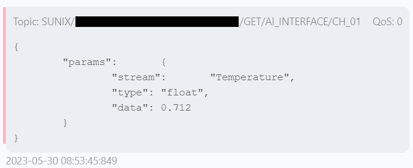

# Nodejs-Practice
這是個人學習與練習 Node.js 所使用的 Repo。

# 課題 Topic. 2
1. 連入 `[ip:port]/doc` 時，可以閱覽 `Swagger` 文件
2. 文件必須包含 `header`、`body`、`param` 與 `response`

# 練習記錄
## 建立 Swagger 雛形
1. 沿用 [Topic. 1](https://github.com/saketora95/Nodejs-Practice/tree/Topic-1) 的架構
2. 於終端機中執行 `npm install @nestjs/swagger swagger-ui-express` 安裝相關套件
3. 修改 `src\main.ts`
```
import { NestFactory } from '@nestjs/core';
import { AppModule } from './app.module';

// 引入 swagger
import { DocumentBuilder, SwaggerModule } from '@nestjs/swagger';

async function bootstrap() {
    const app = await NestFactory.create(AppModule);

    // 設置 swagger
    setupSwagger(app);

    await app.listen(4000);
}

// 設置 swagger
function setupSwagger(app) {
    const builder = new DocumentBuilder();
    const config = builder
      .setTitle('TodoList')
      .setDescription('This is a basic Swagger document.')
      .setVersion('1.0')
      .build();
    const document = SwaggerModule.createDocument(app, config);
    SwaggerModule.setup('api', app, document);
}

bootstrap();
```


## 調整為透過 `[ip:port]/doc` 連入
再次修改 `src\main.ts`：
```
    // 將 'api' 更改為 'doc'，使其可以透過 [ip:port]/doc 連入
    SwaggerModule.setup('doc', app, document);
```


## 建立模擬用的 API
1. 於終端機中執行下列三行指令，建置 `video-info`
```
nest generate module features/video-info
nest generate controller features/video-info
nest generate service features/video-info
```
2. 修改 `src\features\video-info\video-info.service.ts`
```
import { Injectable } from '@nestjs/common';

@Injectable()
export class VideoInfoService {
    video_info_array = [ ... ];

    getVideoInfo(id: string) {
        return this.video_info_array.find(
            (video_info) => video_info.id.toString() === id
        );
    }
}

```
3. 修改 `src\features\video-info\video-info.controller.ts`
```
// 追加引入 Get 與 Param
import { Controller, Get, Param } from '@nestjs/common';

// 引入 VideoInfoService
import { VideoInfoService } from './video-info.service';

@Controller('video-info')
export class VideoInfoController {
    constructor(private readonly videoInfoService: VideoInfoService) {}

    @Get(':id')
    getTodo(@Param('id') id: string) {
        return this.videoInfoService.getVideoInfo(id);
    }
}
```
此時，連入 `http://localhost:4000/video-info/2` 就能取得 `video_info_array` 中設置的模擬資料：


## 設置 `ApiHeader`
1. 於 `src\features\video-info\video-info.controller.ts` 中引入 `ApiHeader`
```
import { ApiBody, ApiHeader, ApiTags } from '@nestjs/swagger';
```
2. 於 `getVideoInfo` 前設置 `ApiHeader`
```
    // 設置 ApiHeader
    @ApiHeader({
        name: 'X-Custom',
        description: 'Try to set custom header.',
    })
    @Get(':id')
    getVideoInfo(@Param('id') id: string) {
        return this.videoInfoService.getVideoInfo(id);
    }
```


## 設置 `ApiResponse`
1. 於 `src\features\video-info\video-info.controller.ts` 中引入 `ApiResponse`
```
import { ApiBody, ApiHeader, ApiResponse, ApiTags } from '@nestjs/swagger';
```
2. 於 `createVideoInfo` 前設置 `ApiResponse`
```
    // 設置 ApiResponse
    @ApiResponse({
        status: HttpStatus.CREATED,
        description: 'The video info has been successfully created.',
    })
    @Post()
    createVideoInfo(@Body() data: CreateVideoInfoDto) {
        return this.videoInfoService.createVideoInfo(data);
    }
```


## `header` 與 `param`


## `body` 與 `response`


# 參考資料
1. [[NestJS 帶你飛！] DAY26 - Swagger (上) - iT 邦幫忙::一起幫忙解決難題，拯救 IT 人的一天](https://ithelp.ithome.com.tw/articles/10280346)
2. [[NestJS 帶你飛！] DAY27 - Swagger (下) - iT 邦幫忙::一起幫忙解決難題，拯救 IT 人的一天](https://ithelp.ithome.com.tw/articles/10280764)

# 編輯記錄
1. 2023-05-15
    - 開始進行 Topic. 2。
    - 完成 `連入 '[ip:port]/doc' 時，可以閱覽 Swagger 文件` 的目標。
    - 完成 `文件必須包含 'header'、'body'、'param' 與 'response'` 的目標。
    - 整理 `README.md` 並完成課題。